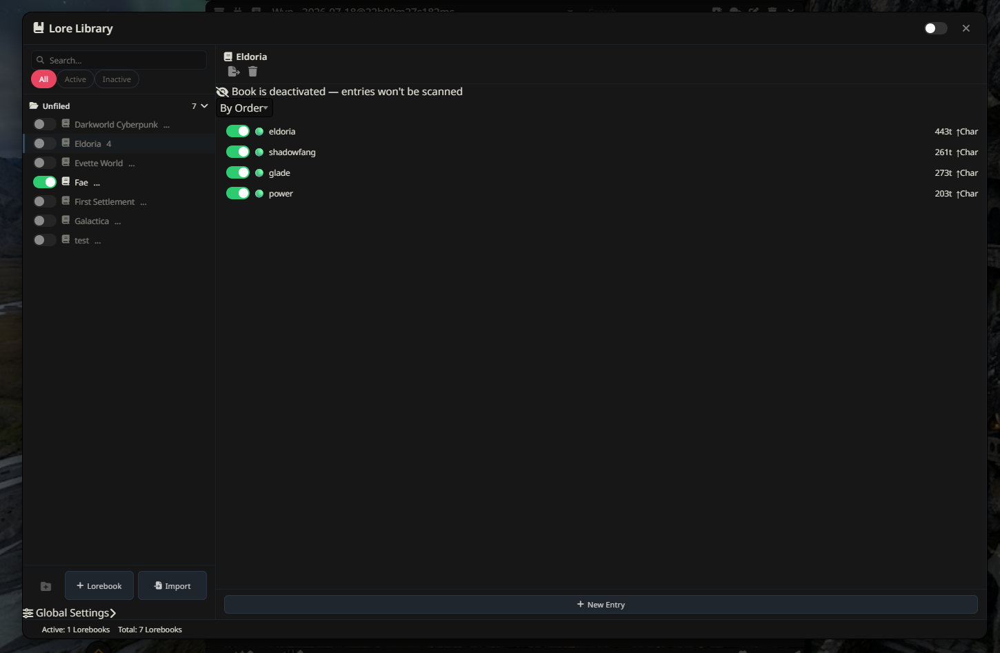

# Lore Library & Campaign Manager

An enhanced Lorebook and Campaign Manager extension for **SillyTavern**. 
It provides a full-featured three-panel desktop layout and an adaptive mobile interface to replace the native World Info interface with streamlined organization, bulk actions, and deep entry editing.

> **Attribution Notice:**  
> This project is extracted and standalone-forked from [DangerDaza's Dooms Enhancement Suite](https://github.com/DangerDaza/Dooms-Enhancement-Suite).

---

## Purpose

A lightweight extraction of the excellent "Lore Library" feature from Doom's Enhancement Suite. Personally, this was the only part I wanted to use, as I use other tracking software. The Lore Library I find much easier to use and less laggy than the native world lore and lorebook editor. So I extracted it.

Warning: This code is heavily altered from the original project as it was not written as a completely separate module. As such there may be undiscovered bugs. I highly recommend you **back up your work**. 

## Key Features

* **Campaign & Library Organization**
  * Group lorebooks into custom-named Campaign folders.
  * Custom icons and color swatches for each library folder.
  * Filter views by **All**, **Active**, **Inactive**, or **Unfiled** lorebooks.
  * Bulk activate, deactivate, or re-assign lorebooks to different campaign folders.

* **3-Panel Desktop Layout**
  * **Left Panel:** Campaign tree navigation, global search, and library controls.
  * **Middle Panel:** Lorebook entry list with token count estimates and instant entry toggles.
  * **Right Panel:** Direct entry editor with side-by-side editing, collapsible advanced settings, and full-screen expansion mode.

* **Advanced Entry Sorting & Editing**
  * Dynamic middle-panel entry sorting by **Order**, **Title**, **Token Count**, or **Status** (Disabled, Normal, Constant, Vectorized)
  * Full access to standard and advanced World Info properties: Positioning (Depth, Role, Outlets), Selective Logic (AND/OR/NOT), Sticky/Cooldown/Delay, Recursion, Group Weighting, and Automation IDs.
  * Token usage estimation per entry and per lorebook.

* **Global World Info Control**
  * Directly modify global scan depth, context budget percentages, cap limits, insertion strategies, and recursive scan settings without opening native sub-menus.

